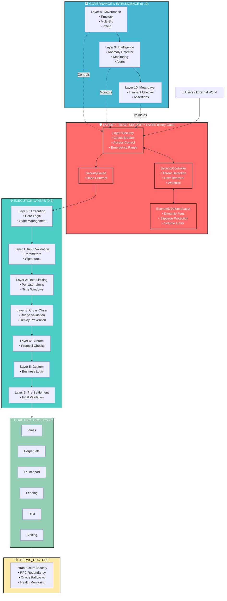
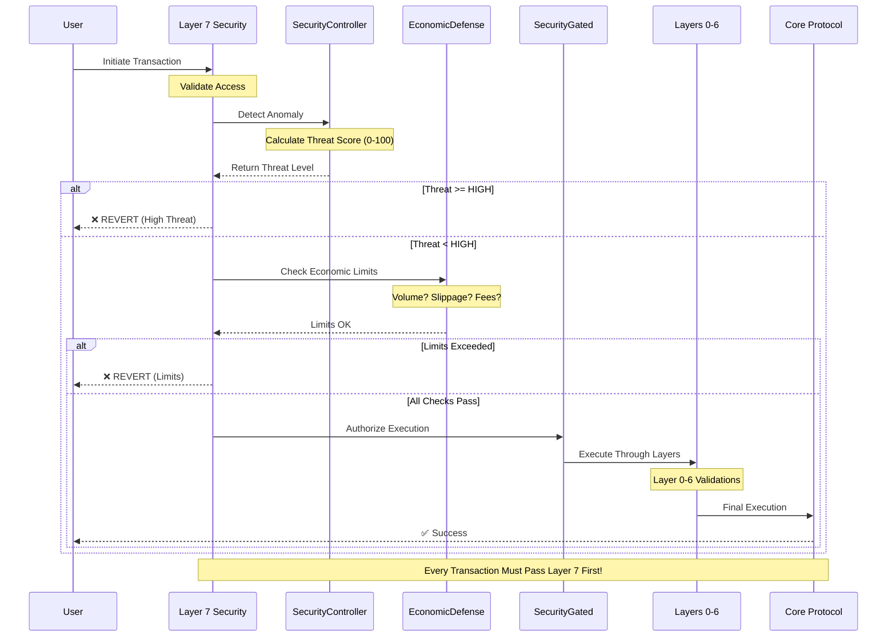
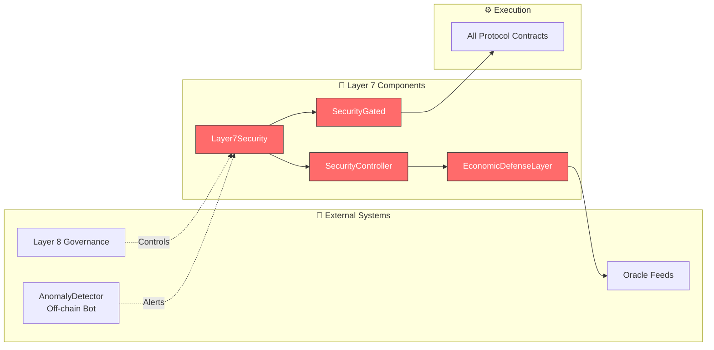
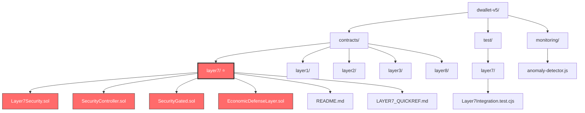
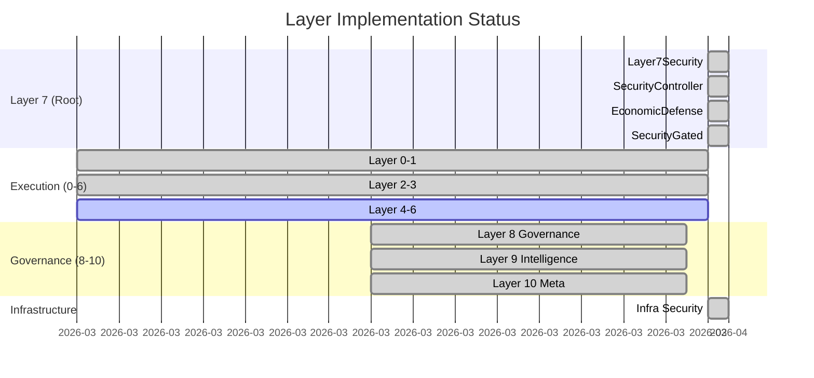
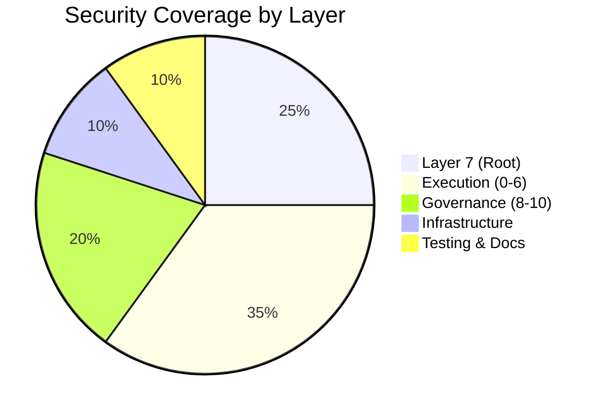

# dWallet v5 - Complete Security Architecture

## Visual Flow Diagram (Mermaid)

---

## Transaction Flow Through Layers

---

## Component Interaction

---

## File Structure Map

---

## Security Layers Comparison

---

## Key Statistics

---

## Quick Reference Table

| Component | Location | Purpose | Status |
|-----------|----------|---------|--------|
| **Layer7Security** | `contracts/layer7/` | Entry gate, circuit breaker | ✅ Complete |
| **SecurityController** | `contracts/layer7/` | Threat detection engine | ✅ Complete |
| **SecurityGated** | `contracts/layer7/` | Base for gated contracts | ✅ Complete |
| **EconomicDefense** | `contracts/layer7/` | Economic protections | ✅ Complete |
| Layer 1-6 | `contracts/layer*/` | Execution layers | ✅ Implemented |
| Layer 8-10 | `contracts/layer*/` | Governance & Intelligence | ✅ Implemented |
| Infrastructure | `contracts/` | RPC & Oracle security | ✅ Complete |
| Formal Verification | `formal-verification/` | Invariants & fuzzing | ✅ Complete |

---

**🎉 Result**: Enterprise-grade security architecture with Layer 7 as the root entry gate controlling all system access!
