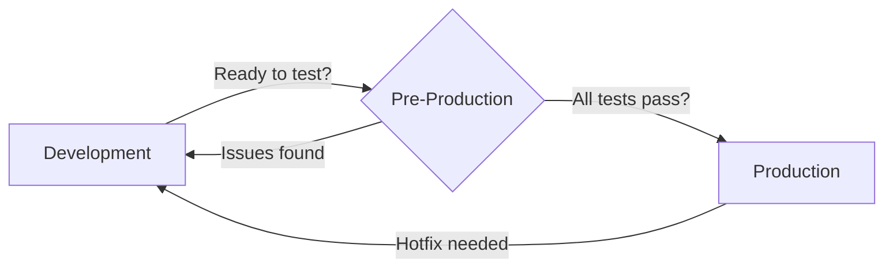

# Environment Comparison Matrix

## Overview

dWallet v5 now supports three distinct environments to ensure safe development, testing, and production deployment.

```
┌──────────────┐      ┌──────────────────┐      ┌──────────────┐
│ DEVELOPMENT  │  →   │ PRE-PRODUCTION   │  →   │ PRODUCTION   │
│ localhost    │      │ Sepolia Testnet  │      │ Mainnet      │
└──────────────┘      └──────────────────┘      └──────────────┘
```

---

## Configuration Files

| Environment | Config File | Vercel Branch | Network |
|-------------|-------------|---------------|---------|
| Development | `.env.local` | N/A (local) | localhost/hardhat |
| Pre-Production | `.env.preproduction` | `pre-production` | Sepolia |
| Production | `.env.production` (not committed) | `main` | Ethereum Mainnet |

---

## Detailed Comparison

### 1. Network & RPC

| Aspect | Development | Pre-Production | Production |
|--------|-------------|----------------|------------|
| **Network** | Hardhat/Localhost | Sepolia Testnet | Ethereum Mainnet |
| **RPC URL** | `http://127.0.0.1:8545` | `https://sepolia.infura.io/v3/{KEY}` | `https://mainnet.infura.io/v3/{KEY}` |
| **Chain ID** | 31337 | 11155111 | 1 |
| **Currency** | Test ETH | Sepolia ETH | Real ETH |
| **Value at Risk** | None | None | **REAL VALUE** |

---

### 2. Smart Contracts

| Aspect | Development | Pre-Production | Production |
|--------|-------------|----------------|------------|
| **Deployment** | Auto-deployed locally | Manual via script | Manual (after testing) |
| **Contract Addresses** | Generated each run | Fixed on Sepolia | Fixed on Mainnet |
| **Verification** | Not needed | Etherscan (Sepolia) | Etherscan (Mainnet) |
| **Gas Costs** | Free (mock) | Free (testnet) | **Real gas fees** |

---

### 3. API Keys & Services

| Service | Development | Pre-Production | Production |
|---------|-------------|----------------|------------|
| **Infura RPC** | Optional | Required (Sepolia) | Required (Mainnet) |
| **Etherscan API** | Optional | Required (Testnet) | Required (Mainnet) |
| **WalletConnect** | Optional | Same project ID | Same project ID |
| **MoonPay** | Disabled | Test Mode (`pk_test_*`) | Live Mode (`pk_live_*`) |
| **Alchemy NFT** | Optional | Optional (Testnet) | Required (Mainnet) |

---

### 4. Security & Warnings

| Feature | Development | Pre-Production | Production |
|---------|-------------|----------------|------------|
| **Console Warning** | 🔧 Blue banner | ⚠️ Orange banner | 🔒 No banner (silent) |
| **Strict Validation** | No | Yes | Yes |
| **Debug Mode** | Enabled | Limited | Disabled |
| **Mainnet TX Blocked** | N/A | ✅ Yes | N/A |
| **Security Headers** | Basic | Full | Full |

---

### 5. Deployment Process

#### Development
```bash
npm run dev
# Runs on http://localhost:5173
# Hot reload enabled
# No deployment needed
```

#### Pre-Production
```bash
# Step 1: Configure
nano .env.preproduction

# Step 2: Deploy
npm run deploy:preproduction
# or
./deploy-preproduction.sh

# Step 3: Deploy to Vercel
vercel --prod --prebuilt
```

#### Production
```bash
# Step 1: Complete pre-production testing
# Step 2: Set production env vars in Vercel dashboard
# Step 3: Deploy from main branch
vercel --prod
```

---

### 6. Environment Variables

```env
# DEVELOPMENT (.env.local)
VITE_ENVIRONMENT=development
VITE_NETWORK=localhost
VITE_INFURA_KEY=optional
DEPLOYER_PRIVATE_KEY=test_key_only

# PRE-PRODUCTION (.env.preproduction)
VITE_ENVIRONMENT=preproduction
VITE_NETWORK=sepolia
VITE_INFURA_KEY=required
DEPLOYER_PRIVATE_KEY=sepolia_test_key_only
VITE_MOONPAY_KEY=pk_test_...

# PRODUCTION (.env.production - NEVER COMMIT)
VITE_ENVIRONMENT=production
VITE_NETWORK=mainnet
VITE_INFURA_KEY=required
DEPLOYER_PRIVATE_KEY=SECURE_MAINNET_KEY
VITE_MOONPAY_KEY=pk_live_...
```

---

### 7. Testing Requirements

| Test Type | Development | Pre-Production | Production |
|-----------|-------------|----------------|------------|
| **Unit Tests** | ✅ Required | ✅ Already passed | ✅ Already passed |
| **Integration Tests** | Partial | ✅ Full suite | Smoke tests only |
| **Manual Testing** | Basic features | ✅ Complete flow | Critical paths only |
| **Security Audit** | Static analysis | Automated scans | External audit |
| **User Acceptance** | Developer only | QA team | Stakeholders |

---

### 8. Visual Indicators

The app displays different banners based on environment:

#### Development
```
🔧 DEVELOPMENT MODE - LOCALHOST
Local development environment with mock data where applicable.
```
**Color**: Blue (#2196F3)

#### Pre-Production
```
⚠️ PRE-PRODUCTION MODE - Testing on SEPOLIA testnet
No real value should be at risk. For testing purposes only.
```
**Color**: Orange (#FF9800)

#### Production
```
(No banner - silent mode)
```
**Color**: None (or optional green)

---

### 9. Common Operations

#### Switch Environments

```bash
# To Development
cp .env.example .env.local

# To Pre-Production
cp .env.preproduction .env.local

# To Production (only in Vercel dashboard)
# Never use production .env locally!
```

#### Check Current Environment

```javascript
import { ENV } from './config/environment';

console.log('Current:', ENV.CURRENT);
console.log('Network:', ENV.NETWORK);
console.log('Is Testnet:', ENV.isTestnet());
```

#### View Console Messages

```bash
# Development
🔧 DEVELOPMENT MODE - LOCALHOST

# Pre-Production
⚠️ PREPRODUCTION MODE - Connected to SEPOLIA testnet.
No real value should be at risk.

# Production
🔒 PRODUCTION MODE - All transactions are real and irreversible.
```

---

### 10. Promotion Workflow



**Step-by-step:**

1. Develop feature in `development`
2. Test locally until working
3. Deploy to `pre-production` (Sepolia)
4. Run full test suite
5. Fix issues if found (back to step 1)
6. When all tests pass → Promote to `production`
7. Monitor production closely

---

## Best Practices

### ✅ DO

- Always test in pre-production first
- Use separate private keys for each environment
- Keep production keys secure (use secrets manager)
- Add environment variables in Vercel dashboard
- Check console warnings to verify environment
- Run full test suite before promotion

### ❌ DON'T

- Never commit `.env.production` to Git
- Never use mainnet private keys in development
- Never skip pre-production testing
- Never deploy directly to production without testing
- Never share production credentials
- Never test high-value transactions first in production

---

## Troubleshooting

### "Wrong Network" Error

**Solution**: Check `.env.local` matches your target environment

```bash
# Verify
grep "VITE_NETWORK" .env.local

# Should show:
# - localhost (development)
# - sepolia (pre-production)
# - mainnet (production)
```

### Banner Not Showing

**Solution**: Import and add `<EnvironmentBanner />` component to your App.jsx

```jsx
import EnvironmentBanner from './components/EnvironmentBanner';

function App() {
  return (
    <>
      <EnvironmentBanner />
      {/* rest of app */}
    </>
  );
}
```

### Build Fails in Pre-Production

**Solution**: Ensure all required env vars are set

```bash
# Check required variables
cat .env.preproduction | grep -E "INFURA_KEY|ETHERSCAN_KEY|DEPLOYER_PRIVATE_KEY"
```

---

## Summary

| Priority | Environment | Purpose | Risk Level |
|----------|-------------|---------|------------|
| 🥇 First | Development | Build & debug | Zero |
| 🥈 Second | Pre-Production | Test & validate | **Zero** (testnet) |
| 🥉 Final | Production | Live users | **HIGH** (real value) |

**Golden Rule**: If it hasn't been tested in pre-production, it doesn't go to production! 🛡️
