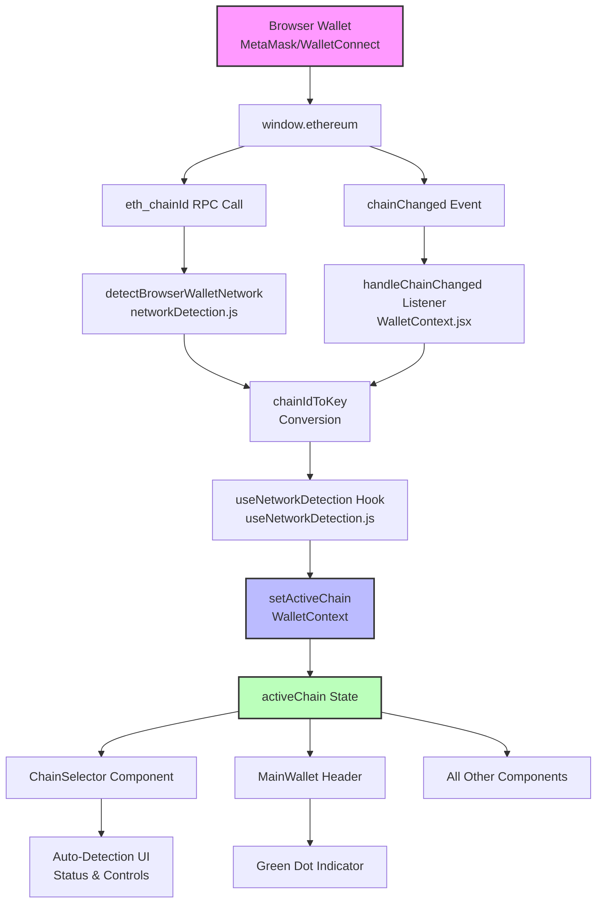

# Automatic Network Detection - Architecture

## System Architecture Diagram



## Quick Start Guide

### For Users

**How to use automatic network detection:**

1. **Start the app:**
   ```bash
   npm run dev
   ```

2. **Connect your wallet** (MetaMask, etc.) to the app

3. **Switch networks in your wallet** (e.g., from Ethereum to Sepolia)

4. **Watch the app automatically update!**
   - The chain badge in the header changes
   - A green dot appears (auto-detection active)
   - Balances and tokens update for the new network

5. **Manual override (if needed):**
   - Click the chain badge in the header
   - See the auto-detection status box
   - Toggle "Auto ON/OFF" to enable/disable
   - Click "Refresh" to re-detect
   - Or manually select any network from the list

### For Developers

**Test the feature:**

1. Open browser console (F12)
2. Copy/paste content from `test-network-detection.js`
3. Run: `testNetworkDetection()`
4. Switch networks in your wallet and watch console logs

**Use in your code:**

```javascript
import { useNetworkDetection } from '../hooks/useNetworkDetection'

function MyComponent() {
  const { detectedChain, autoDetectEnabled } = useNetworkDetection()
  
  return (
    <div>
      <p>Detected: {detectedChain}</p>
      <p>Auto-detect: {autoDetectEnabled ? 'ON' : 'OFF'}</p>
    </div>
  )
}
```

## Data Flow

### 1. Initial Detection (App Load)

```
App Starts
    ↓
WalletContext.jsx mounts
    ↓
useEffect runs (autoNetworkDetectEnabled = true)
    ↓
detectBrowserWalletNetwork() called
    ↓
window.ethereum.request('eth_chainId')
    ↓
Returns chainId (e.g., '0x1' or '0x13881')
    ↓
chainIdToKey converts: '0x1' → 'ethereum'
    ↓
setActiveChainRaw('ethereum')
    ↓
activeChain state updates
    ↓
All components re-render with new chain
```

### 2. Real-time Detection (Network Change)

```
User switches network in MetaMask
    ↓
window.ethereum emits 'chainChanged' event
    ↓
handleChainChanged listener triggered
    ↓
chainIdToKey(chainId) converts chain ID
    ↓
setActiveChainRaw(newChainKey)
    ↓
activeChain state updates
    ↓
UI updates automatically:
  - Chain badge shows new network
  - Balances refresh for new chain
  - Transactions update
  - Token list changes
```

### 3. Manual Override

```
User opens ChainSelector modal
    ↓
Sees auto-detection status box
    ↓
Clicks "Auto OFF" button
    ↓
toggleAutoDetect() → autoDetectEnabled = false
    ↓
Auto-detection listeners paused
    ↓
User manually selects network
    ↓
handleSelect(chainId) → setActiveChain(chainId)
    ↓
App uses selected network
```

## Component Hierarchy

```
App
└── WalletProvider (WalletContext.jsx)
    ├── autoNetworkDetectEnabled state
    ├── activeChain state
    ├── useEffect: Initial detection
    └── useEffect: chainChanged listener
        │
        └── MainWallet (MainWallet.jsx)
            ├── useNetworkDetection hook
            ├── Header
            │   └── Chain Badge
            │       └── Green dot (if auto-detect active)
            │
            └── ChainSelector (ChainSelector.jsx)
                ├── useNetworkDetection hook
                ├── Auto-detection status box
                ├── Toggle button (Auto ON/OFF)
                ├── Refresh button
                └── Network list
```

## State Management

### WalletContext State

```javascript
{
  activeChain: 'ethereum',           // Current active chain key
  autoNetworkDetectEnabled: true,    // Auto-detection toggle
  setActiveChain: (chain) => {...},  // Manual chain setter
}
```

### useNetworkDetection Hook State

```javascript
{
  isDetecting: false,                // Detection in progress
  detectedChain: 'ethereum',         // Currently detected chain
  error: null,                       // Detection error
  autoDetectEnabled: true,           // Auto-detection toggle
  toggleAutoDetect: () => {...},     // Toggle function
  refreshDetection: () => {...},     // Manual refresh
  hasEthereumWallet: true,           // Browser wallet present
}
```

## Chain ID Mapping

### Supported Networks

| Chain Key | Chain ID (Decimal) | Chain ID (Hex) | Network Name |
|-----------|-------------------|----------------|--------------|
| ethereum | 1 | 0x1 | Ethereum Mainnet |
| sepolia | 11155111 | 0x13881 | Sepolia Testnet |
| baseSepolia | 84532 | 0x14a34 | Base Sepolia |
| base | 8453 | 0x2105 | Base Mainnet |
| bnb | 56 | 0x38 | BNB Chain |
| polygon | 137 | 0x89 | Polygon |
| arbitrum | 42161 | 0xa4b1 | Arbitrum |
| optimism | 10 | 0xa | Optimism |
| avalanche | 43114 | 0x9d42 | Avalanche |

### Conversion Logic

```javascript
// Hex to Key
chainIdToKey('0x1') → 1 → 'ethereum'

// Decimal to Key
chainIdToKey(11155111) → 11155111 → 'sepolia'

// Key to Hex (for wallet requests)
'ethereum' → 1 → '0x1'
```

## Event Listeners

### window.ethereum Events

1. **chainChanged**
   - Triggered: User switches network in wallet
   - Payload: chainId (hex string)
   - Action: Update activeChain automatically

2. **accountsChanged**
   - Triggered: User switches account
   - Payload: accounts array
   - Action: (Handled elsewhere in app)

### Cleanup

```javascript
useEffect(() => {
  window.ethereum.on('chainChanged', handler)
  
  return () => {
    window.ethereum.removeListener('chainChanged', handler)
  }
}, [dependencies])
```

## Error Handling

### Scenarios

1. **No Browser Wallet**
   - `window.ethereum` is undefined
   - Auto-detection skipped
   - Manual selection only

2. **Unsupported Network**
   - Chain ID not in CHAIN_ID_TO_KEY map
   - Error message shown
   - User can manually select network

3. **RPC Request Fails**
   - Try-catch wraps detectBrowserWalletNetwork()
   - Warning logged to console
   - Falls back to previous network

4. **Listener Error**
   - Wrapped in try-catch
   - Non-blocking error
   - App continues with current network

## Security Considerations

✅ **No private keys exposed** - Only reads public chain ID  
✅ **Read-only operation** - Doesn't modify wallet state  
✅ **User control** - Can disable auto-detection anytime  
✅ **Fallback safe** - Defaults to manual selection if fails  
✅ **No external calls** - Uses local window.ethereum only  

## Performance

### Optimizations

1. **Debounced Detection**
   - Only detects on mount and network changes
   - No polling or continuous requests

2. **Conditional Listeners**
   - Only attaches if autoDetectEnabled = true
   - Removes listeners on cleanup

3. **Memoized Functions**
   - useCallback for detection functions
   - Prevents unnecessary re-renders

4. **Early Returns**
   - Skips detection if no wallet
   - Skips if auto-detect disabled

## Extensibility

### Adding New Networks

**Step 1:** Add to `src/data/chains.js`
```javascript
newChain: {
  id: 'newChain',
  name: 'New Chain',
  chainId: 12345,
  // ... config
}
```

**Step 2:** Add to `src/utils/networkDetection.js`
```javascript
export const CHAIN_ID_TO_KEY = {
  12345: 'newChain',
}
```

**Step 3:** (Optional) Add token contracts to WalletContext

That's it! Auto-detection will work immediately.

### Adding New Wallet Types

The system works with any wallet that implements the EIP-1193 provider interface:
- MetaMask
- WalletConnect
- Coinbase Wallet
- Rainbow
- Trust Wallet
- Any EIP-1193 compatible wallet

No code changes needed - they all use `window.ethereum`!

## Testing Strategy

### Unit Tests
- chainIdToKey conversion
- detectBrowserWalletNetwork function
- Event listener attachment/removal

### Integration Tests
- Network change triggers UI update
- Toggle auto-detect enables/disables listeners
- Manual override works correctly

### Manual Tests
- Switch networks in MetaMask
- Verify app updates instantly
- Check green dot indicator
- Test toggle functionality

---

**Last Updated:** 2026-04-19  
**Version:** 1.0.0
