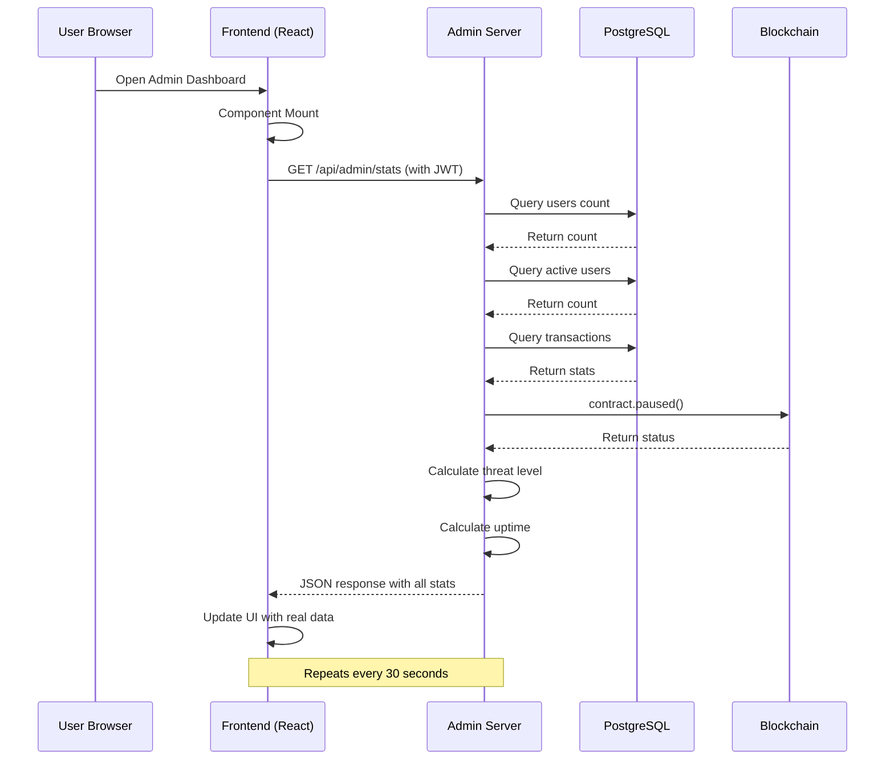
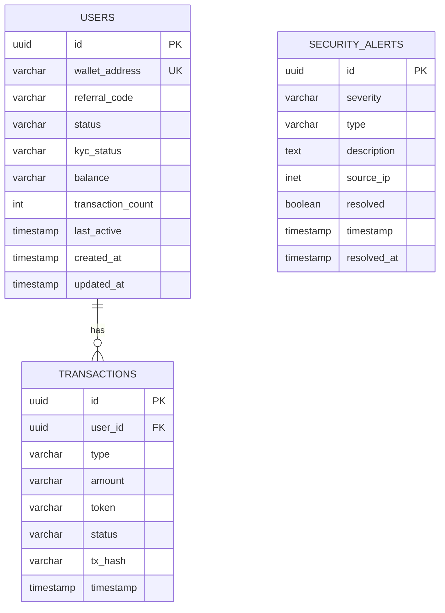
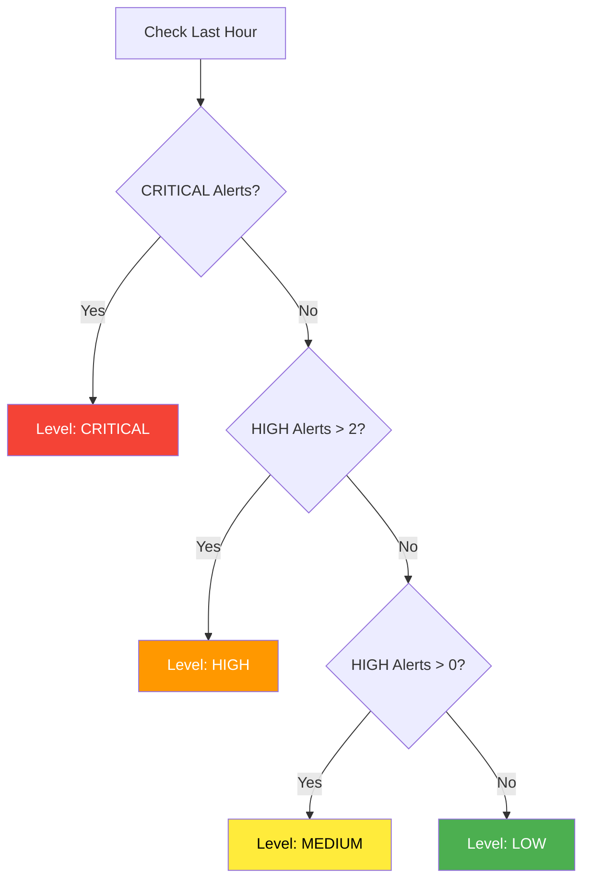
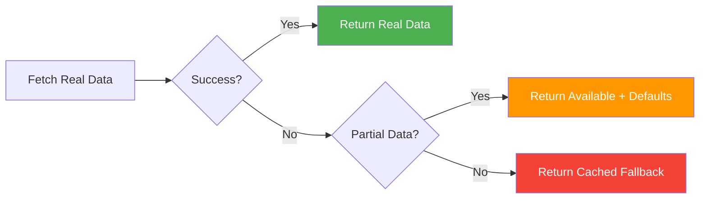
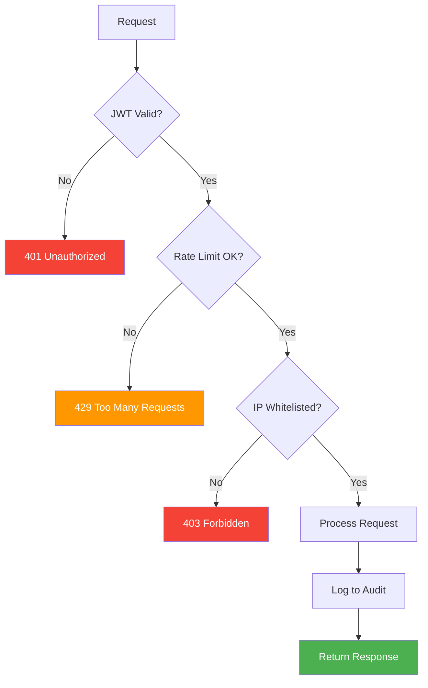

# Admin Dashboard - Real Data Architecture

## System Overview Diagram

```mermaid
graph TB
    A[Admin Dashboard Frontend] -->|HTTP GET /api/admin/stats| B[Enterprise Admin Server]
    A -->|HTTP GET /api/admin/system-health| B
    
    B -->|Query| C[(PostgreSQL Database)]
    B -->|RPC Call| D[Base Sepolia Blockchain]
    B -->|Check| E[Server Process]
    
    C -->|Users Count| F[Total Users]
    C -->|Active Users 24h| G[Active Users]
    C -->|Transaction Sum| H[Total Volume]
    C -->|Security Alerts| I[Threat Level]
    
    D -->|paused()| J[Contract Status]
    
    E -->|process.uptime()| K[Uptime]
    
    F --> L[Stats Response]
    G --> L
    H --> L
    I --> L
    J --> L
    K --> L
    
    L -->|JSON Response| A
    
    style A fill:#4CAF50,color:#fff
    style B fill:#2196F3,color:#fff
    style C fill:#FF9800,color:#fff
    style D fill:#9C27B0,color:#fff
```

## Data Sources Breakdown

### 📊 System Statistics (`/api/admin/stats`)

| Metric | Source | Query/Method | Update Frequency |
|--------|--------|--------------|------------------|
| **Total Users** | PostgreSQL | `SELECT COUNT(*) FROM users` | Real-time |
| **Active Users (24h)** | PostgreSQL | `SELECT COUNT(*) FROM users WHERE last_active >= NOW() - INTERVAL '24 hours'` | Real-time |
| **Total Transactions** | PostgreSQL | `SELECT COUNT(*) FROM transactions` | Real-time |
| **Total Volume** | PostgreSQL | `SELECT SUM(amount) FROM transactions` → Format to K/M | Real-time |
| **Contract Status** | Base Sepolia | `contract.paused()` via ethers.js | Real-time |
| **Threat Level** | PostgreSQL | Count alerts by severity in last hour | Real-time |
| **Uptime** | Server Process | `process.uptime()` | Real-time |

### 🏥 System Health (`/api/admin/system-health`)

| Component | Check Method | Status Values |
|-----------|--------------|---------------|
| **API Gateway** | Server running | Operational / Error |
| **Smart Contracts** | `provider.getBlockNumber()` | Active / Syncing / Error |
| **Database** | `SELECT 1` query | Connected / Disconnected |
| **Monitoring** | Check SENTRY_DSN env | Running / Disabled |

## Request Flow



## Database Schema



## Threat Level Calculation



## Volume Formatting Logic

```javascript
const volumeEth = parseFloat(ethers.formatEther(volumeWei));

if (volumeEth >= 1,000,000) {
  return `${(volumeEth / 1,000,000).toFixed(1)}M`  // e.g., "2.4M"
} else if (volumeEth >= 1,000) {
  return `${(volumeEth / 1,000).toFixed(1)}K`      // e.g., "850.5K"
} else {
  return volumeEth.toFixed(2)                        // e.g., "123.45"
}
```

## Contract Status Check

```javascript
// Connect to Base Sepolia
const provider = new ethers.JsonRpcProvider(BASE_SEPOLIA_RPC_URL);

// Load DWT token contract
const dwtContract = new ethers.Contract(
  DWT_TOKEN_ADDRESS,
  ['function paused() view returns (bool)'],
  provider
);

// Check if paused
const isPaused = await dwtContract.paused();
return isPaused ? 'Paused' : 'Active';
```

## Error Handling & Fallbacks



**Fallback Values:**
- Total Users: 1247
- Active Users: 89
- Total Transactions: 15632
- Total Volume: "2.4M"
- Contract Status: "Active"
- Threat Level: "LOW"
- Uptime: "99.9%"

## Security Layers



## Auto-Refresh Mechanism

```javascript
// SystemOverview.jsx
useEffect(() => {
  // Initial load
  loadStats()
  
  // Set up 30-second interval
  const interval = setInterval(loadStats, 30000)
  
  // Cleanup on unmount
  return () => clearInterval(interval)
}, [])
```

**Refresh Intervals:**
- System Overview: Every 30 seconds
- System Health: Every 30 seconds (with stats)
- User Management: Manual refresh
- Transaction Monitor: Manual refresh

## Production Deployment Checklist

- [x] PostgreSQL database configured
- [x] Blockchain RPC endpoint set
- [x] Database tables created
- [x] Error handling implemented
- [x] Fallback mechanisms in place
- [x] Audit logging enabled
- [x] Rate limiting active
- [x] Authentication required
- [x] Frontend auto-refresh working
- [x] Health checks operational

---

**Architecture Version**: 3.1.0  
**Last Updated**: April 22, 2026  
**Status**: ✅ Production Ready
